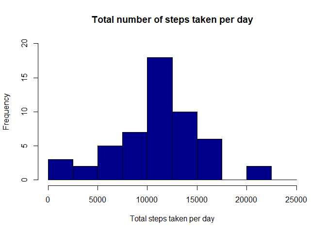
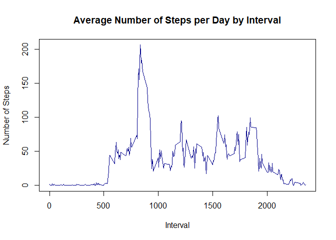
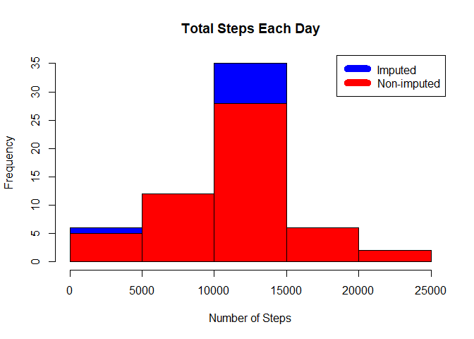
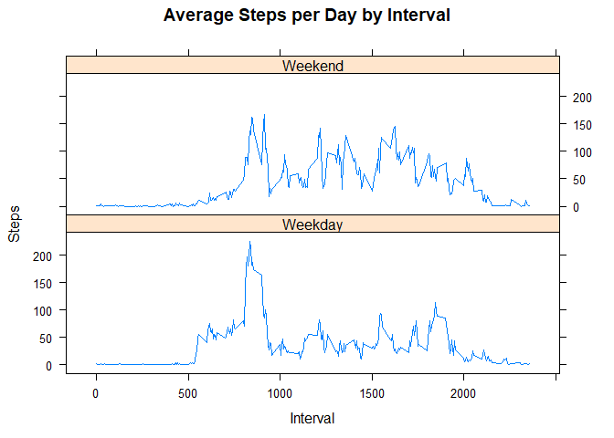

Loading and preprocessing the data
----------------------------------

Unzip and load data into data frame `data`.

    if(!file.exists('activity.csv')){
      unzip('activity.zip')
    }
    data <- read.csv("activity.csv")

1. What is mean total number of steps taken per day?
----------------------------------------------------

    steps_by_day <- aggregate(steps ~ date, data, sum)

-   Make a histogram of the total number of steps taken each day

<!-- -->

    hist(steps_by_day$steps, main = "Total number of steps taken per day", xlab = "Total steps taken per day", col = "darkblue", ylim = c(0,20), breaks = seq(0,25000, by=2500))

-   Calculate and report the **mean** and **median** total number of
    steps taken per day

<!-- -->

    rmean <- mean(steps_by_day$steps)
    rmedian <- median(steps_by_day$steps)

The `mean` is 1.076618910^{4} and the `median` is 10765.

2. What is the average daily activity pattern?
----------------------------------------------

-   Make a time series plot (i.e. type = "l") of the 5-minute interval
    (x-axis) and the average number of steps taken, averaged across all
    days (y-axis)

<!-- -->

    steps_by_interval <- aggregate(steps ~ interval, data, mean)
    plot(steps_by_interval$interval,steps_by_interval$steps, type="l", col="darkblue", xlab="Interval", ylab="Number of Steps",main="Average Number of Steps per Day by Interval")

-   Which 5-minute interval, on average across all the days in the
    dataset, contains the maximum number of steps?

<!-- -->

    max_interval <- steps_by_interval[which.max(steps_by_interval$steps),1]

Most Steps at:835.

3. Imputing missing values
--------------------------

-   Calculate and report the total number of missing values in the
    dataset (i.e. the total number of rows with NAs)

<!-- -->

    incomplete <- sum(is.na(data))

Number of missing values:2304.

-   Devise a strategy for filling in all of the missing values in the
    dataset. The strategy does not need to be sophisticated. For
    example, you could use the mean/median for that day, or the mean for
    that 5-minute interval, etc. Compare imputed to non-imputed data.
    Missing values were imputed by inserting the average for each
    interval. Thus, if interval 10 was missing on 10-02-2012, the
    average for that interval for all days (0.1320755), replaced the NA.

<!-- -->

    imputed_data <- transform(data, steps = ifelse(is.na(data$steps), steps_by_interval$steps[match(data$interval, steps_by_interval$interval)], data$steps))

-   Create a new dataset that is equal to the original dataset but with
    the missing data filled in.

Zeroes were imputed for 10-01-2012 because it was the first day and
would have been over 9,000 steps higher than the following day, which
had only 126 steps. NAs then were assumed to be zeros to fit the rising
trend of the data.

    imputed_data[as.character(imputed_data$date) == "2012-10-01", 1] <- 0

-   Make a histogram of the total number of steps taken each day and
    Calculate and report the mean and median total number of steps taken
    per day.

Recount total steps by day and create Histogram.

    steps_by_day_i <- aggregate(steps ~ date, imputed_data, sum)
    hist(steps_by_day_i$steps, main = paste("Total Steps Each Day"), col="blue", xlab="Number of Steps")

    #Create Histogram to show difference.

    hist(steps_by_day$steps, main = paste("Total Steps Each Day"), col="red", xlab="Number of Steps", add=T) 
    legend("topright", c("Imputed", "Non-imputed"), col=c("blue", "red"), lwd=10)

Calculate new mean and median for imputed data.

    rmean.i <- mean(steps_by_day_i$steps)
    rmedian.i <- median(steps_by_day_i$steps)

Calculate difference between imputed and non-imputed data.

    mean_diff <- rmean.i - rmean
    med_diff <- rmedian.i - rmedian

Calculate total difference.

    total_diff <- sum(steps_by_day_i$steps) - sum(steps_by_day$steps)

-   The imputed data mean is 1.058969410^{4}
-   The imputed data median is 1.076618910^{4}
-   The difference between the non-imputed mean and imputed mean is
    -176.4948964
-   The difference between the non-imputed mean and imputed mean is
    1.1886792
-   The difference between total number of steps between imputed and
    non-imputed data is 7.536332110^{4}. Thus, there were
    7.536332110^{4} more steps in the imputed data.

4. Are there differences in activity patterns between weekdays and weekends?
----------------------------------------------------------------------------

-   Create a new factor variable in the dataset with two levels –
    “weekday” and “weekend” indicating whether a given date is a weekday
    or weekend day.

<!-- -->

    weekdays <- c("Monday", "Tuesday", "Wednesday", "Thursday", 
                  "Friday")
    # For Sunday and Saturday : weekend, Other days : weekday 
    imputed_data$dow = as.factor(ifelse(is.element(weekdays(as.Date(imputed_data$date)),weekdays), "Weekday", "Weekend"))

-   Make a panel plot containing a time series plot (i.e. type = "l") of
    the 5-minute interval (x-axis) and the average number of steps
    taken, averaged across all weekday days or weekend days (y-axis).
    The plot should look something like the following, which was
    creating using simulated data

<!-- -->

    steps_by_interval_i <- aggregate(steps ~ interval + dow, imputed_data, mean)
    library(lattice)
    xyplot(steps_by_interval_i$steps ~ steps_by_interval_i$interval|steps_by_interval_i$dow, main="Average Steps per Day by Interval",xlab="Interval", ylab="Steps",layout=c(1,2), type="l")

